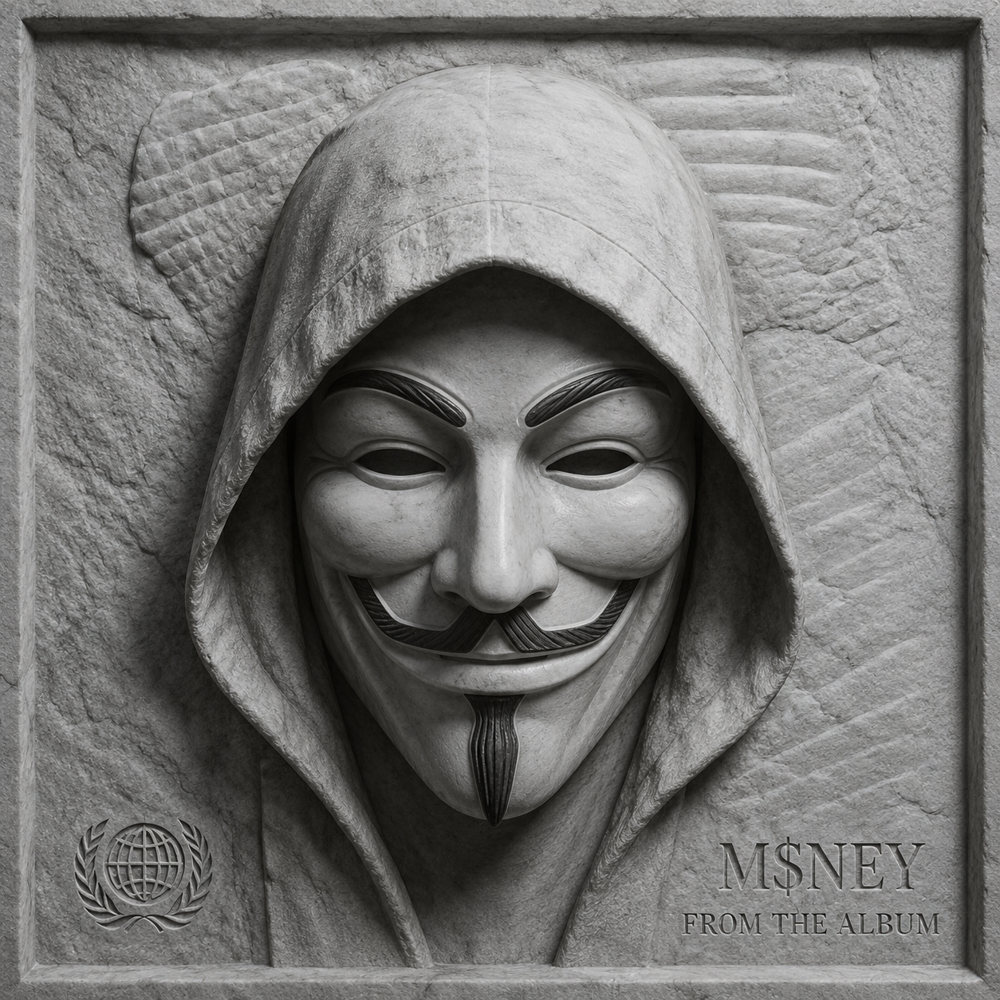

<div align="center">

<!-- Animated Terminal Header -->


<!-- Profile Picture with Glow Ring -->


<br><br>

<!-- Status Badges -->


<br>

<!-- Social / Contact -->
<a href="mailto:anonym09g@gmail.com">
  
</a>
<a href="https://github.com/anonymous-beta">
  
</a>

<br><br>

<!-- Matrix Rain Divider -->


</div>

---

## 🧬 IDENTITY

```yaml
codename: ANONYMOUS-BETA
legal_name: Brian
age: 17
classification: "Ethical Hacker | Red Team Operator | Developer"
mission: "Out with the old, in with the new. Time for the next generation."
current_phase: "THE EVOLUTION"
projects: ∞ [CLASSIFIED]
```

---

## ⚡ TECH ARSENAL

<div align="center">

| Domain | Skills | Proficiency |
|--------|--------|-------------|
| **Languages** | Python, JavaScript, C++, Bash, Assembly, Rust | ████████░░ |
| **Offensive Security** | Web App Pentesting, Network Analysis, Reverse Engineering, Zero Day Research | ███████░░░ |
| **Red Team Ops** | Phishing, Social Engineering, C2 Infrastructure, Evasion | ████████░░ |
| **Development** | Full Stack, Automation, Tool Building, AI Integration | █████████░ |
| **Mobile Security** | Android Pentesting, Termux Tooling, APK Analysis | ██████░░░░ |

</div>

---

## 🔥 TOP TIER ARSENAL

<div align="center">

<!-- FORSAKE -->
<a href="https://github.com/anonymous-beta/Forsake">
  
</a>

<!-- WebFly -->
<a href="https://github.com/anonymous-beta/WebFly">
  
</a>

<!-- MYSONINJA -->
<a href="https://github.com/anonymous-beta/MYSONINJA">
  
</a>

<!-- TINUBULUX -->
<a href="https://github.com/anonymous-beta/TINUBULUX">
  
</a>

<!-- Boogie -->
<a href="https://github.com/anonymous-beta/Boogie">
  
</a>

</div>

---

## 🚀 ACTIVE OPERATIONS

```
$ ls -la /var/projects/

drwxr-xr-x    legacy_pwnage/     # 47 repos [DEPRECATED]
drwx------    next_gen_tools/    # 23 repos [CLASSIFIED]
-rwxr-xr-x    .new_era.sh        # Executing now
-rw-r--r--    takeover.log       # Progress: 73%

$ cat .new_era.sh
#!/bin/bash
echo "The future doesn't wait. Neither do I."
```

---

## 📊 SYSTEM METRICS

<div align="center">


<br>


<br>

<!-- Trophy Case -->


<br>

<!-- Activity Graph -->


</div>

---

## 🎯 CURRENT OBJECTIVES

```javascript
const nextGen = {
  age: 17,
  mission: "Replace legacy systems",
  strategy: {
    phase1: "Learn from the old",
    phase2: "Build the new", 
    phase3: "🚀 DEPLOY"
  },
  mindset: "Growth is mandatory",
  
  execute() {
    while(this.age < 18) {
      this.skills += Infinity;
      this.building = true;
    }
  }
};

nextGen.execute();
```

---

## ⚠️ CLASSIFIED DATA

<div align="center">

```
┌─────────────────────────────────────────────┐
│  ACCESS LEVEL: BETA TESTER                  │
│  STATUS: BUILDING THE FUTURE                │
│  WARNING: May cause innovation              │
│  NEXT CHECKPOINT: 18 YEARS OLD              │
│  THREAT LEVEL: ████████░░ HIGH             │
└─────────────────────────────────────────────┘
```

</div>

---

## 🔗 SECURE CHANNELS

<div align="center">

<a href="mailto:anonym09g@gmail.com">
  
</a>

<br><br>

<!-- Profile Views Counter -->


<br>

<!-- Snake Animation -->


</div>

---

<div align="center">

```
⚡ 17 // BUILDING // HACKING // EVOLVING ⚡
[SYSTEM] Ready for next deployment...
[STATUS] Online and dangerous...
[WARNING] Future in progress...
```

<!-- Footer Wave -->


</div>
